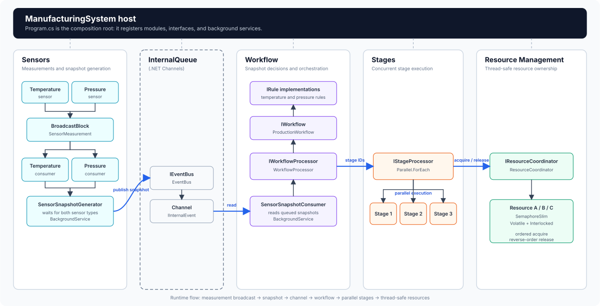

# Manufacturing System

A .NET 10 worker that models a manufacturing workflow driven by temperature and
pressure measurements. It captures an immutable sensor snapshot every polling
interval, evaluates workflow rules, and runs eligible stages while coordinating
shared resources.

## Processing flow

```text
TemperatureSensor ─┐
                   ├─> BroadcastBlock<SensorMeasurement>
PressureSensor ────┘               │
                                   ├─> Temperature consumer ─┐
                                   └─> Pressure consumer ────┤
                                                            v
                                               SensorSnapshotGenerator
                                                            │
                                                Channel<IInternalEvent>
                                                            │
                                                            v
                                                SensorSnapshotConsumer
                                                            │
                                                            v
                                                  WorkflowProcessor
                                                            │
                                                            v
                                         StageProcessor (Parallel.ForEach)
                                              │         │         │
                                              v         v         v
                                           Stage 1   Stage 2   Stage 3
                                              │         │         │
                                              └─────────┼─────────┘
                                                acquire │ release
                                                        v
                                             ResourceCoordinator
                                      Thread-safe resource state access
                                      SemaphoreSlim + Volatile + Interlocked
                                      ordered acquire + reverse-order release
```

1. `TemperatureSensor` and `PressureSensor` publish `SensorMeasurement` values to a shared `BroadcastBlock` when their `ReadAsync` methods are called.
2. `SensorSnapshotGenerator` has separate temperature and pressure consumers. It waits for one measurement from each and creates a `SensorSnapshot`.
3. The snapshot is written to the in-memory `EventBus`, which is backed by a .NET `Channel<T>`.
4. `SensorSnapshotConsumer` reads snapshots and passes each one to every registered workflow through `IWorkflowProcessor`.
5. `ProductionWorkflow` applies its rules and selects distinct stages.
6. `StageProcessor` executes selected stages and releases their resources when execution finishes.
7. `ResourceCoordinator` acquires resources in ordinal ID order and releases them in reverse order.

## Architecture and modules



The sensor, workflow, stage, and resource-management modules live in the main `src/Modules/ManufacturingSystem` project and collaborate through their interfaces. `InternalQueue` is a separate library under `src/Libraries` referenced by the host and provides the channel-backed event boundary between snapshot production and workflow processing.

## Concurrency concerns

Stages can execute in parallel and may require overlapping resources. `ResourceCoordinator` and `Resource` protect those resources from deadlock, atomicity violations, and stale reads between threads.

### Deadlock prevention

Every resource request follows one canonical order. `ResourceCoordinator` removes duplicate IDs and sorts the resources with `StringComparer.Ordinal` before acquiring them. Therefore, two stages requesting the same resources in different declaration orders still acquire them in the same order, preventing a circular wait.

Resources are acquired one at a time. If a later resource cannot be acquired because it is in the `Error` state or acquisition is cancelled, the coordinator rolls back the resources already acquired. Rollback and normal cleanup release resources in reverse acquisition order.

This guarantee assumes all resource acquisition goes through `ResourceCoordinator`.

### Atomicity

The `Idle` check and the transition to `Busy` form one compound operation. `Resource` protects that operation with a per-resource `SemaphoreSlim`, so only one thread at a time can check or change that resource's state.

The actual `Busy` and `Idle` assignments use `Interlocked.Exchange`. Each state change is therefore atomic and cannot be observed as a partially written value. A competing acquisition sees either the previous state or the complete new state.

### Memory ordering and visibility

`Resource.State` and the acquisition check use `Volatile.Read`. This prevents a thread from relying on a stale cached state and ensures it observes state writes made by other threads.

`Interlocked.Exchange` provides an atomic read-modify-write operation with memory-ordering guarantees. Together with `Volatile.Read` and the synchronization performed by `SemaphoreSlim`, a successful `Busy` or `Idle` transition becomes visible to threads that subsequently inspect or acquire the resource.

These synchronization guarantees are in-process only. `SemaphoreSlim`, `Volatile`, and `Interlocked` do not coordinate resources across different operating-system processes or machines.

## Project structure

```text
ManufacturingSystem/
├── docs/
│   └── SystemArchitecture.svg     Architecture and module diagram
├── src/
│   ├── Libraries/InternalQueue/   In-memory Channel event bus
│   └── Modules/
│       └── ManufacturingSystem/   Main worker project
│           ├── Sensors/           Sensors, measurements, and snapshots
│           └── Workflow/          Rules, stages, resources, and workflows
└── test/ManufacturingSystem.Test/ xUnit and Moq tests
```

## Requirements

- .NET 10 SDK

## Build and run

```bash
dotnet restore ManufacturingSystem.sln
dotnet build ManufacturingSystem.sln --no-restore
dotnet run --project src/Modules/ManufacturingSystem/ManufacturingSystem.csproj
```

## Run tests

```bash
dotnet test test/ManufacturingSystem.Test/ManufacturingSystem.Test.csproj
```

The tests use xUnit, Moq, constructor-based setup, and explicit Arrange-Act-Assert sections.

## Current scope

- Communication is in-process and in-memory.
- Queued snapshots are lost when the process stops.
- `BroadcastBlock<T>` distributes measurements only to subscribers in the current process.
- `SensorSnapshotGenerator` does not poll sensors. Another caller or service must invoke each sensor's `ReadAsync` method so measurements are broadcast.
- A snapshot is created after both a temperature and a pressure measurement have arrived.
